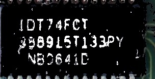
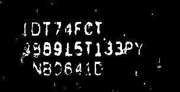

# detect (and replace) a specific **HSV_based or HSL_based** color Considering the maximum difference in HSV instead of RGB values
first of all i apologize for my english. I am an electrical engineering PhD student in university of Tehran, Iran.  
this code is an extraction of color similarity based on HSV parameters which is closer to the similarity of color in the human concept. 
here we accept a few difference between ideal color and pixel color. 
Considering that the photos were taken in the real environment, as a result the color in all pixels are not exactly the same color .  
As a result, using offline or online color-pickers, we can earn the actual color of specified color.  
In this coding, the internet address https://imageresizer.com/color-picker is used to extract the colors, but as mentioned, there are different methods to extract the color of the image.  
It should also be noted that due to the fact that color extraction is more available in RGB format, the user does not need to extract HSV values, but simply extracting color values ​​in RGB format is sufficient. Color conversion from RGB to HSV is done automatically in the code. 
if there is a problem cantact me using my email address: sh.dalirian@ut.ac.ir 
my linkedin profile address is : linkedin.com/in/sh-d-30174b77  
## run: main.py
the main function in this application is: 
**color_similarity_HSV(img,specific_colors,ideal_color=[0,0,255],distance:int=40,sensivity:str="uniform",limit_other_colors:bool=False)**  
## application:
detect (and replace) specific color in image based on HSV parameters instead of RGB with an specific HSV-distance range acceptable.  

## adjustable parameters:
The color_similarity_HSV function is called to detect the specific color. 
According to above, this function has six inputs: 
    1. img: The first input is an image whose its pixels color are to be detected. 
    2. specific_colors: The second input is the color in HSV which we are looking for it in the input image. it is white in default 
    3. distance: The third input of this function is dist. This variable specifies the maximum color difference of the pixel with the HSV color of specific_colors. The default value of this variable is 40, which means that if the square of the squared difference between the pixels with the selected color is less than 40, it will be counted in counting the number of pixels similar to that particular color. 
    4. sensivity: sensivity has three modes: {"uniform" for uniform distribution, "center" for focusing on the center, "around" focusing on the edge of the image} This sensitivity is defined by the sensitivity input variable, which by default calculates the color similarity uniformly without considering the (x,y) location of pixcel. 
    5. limit_other_colors: this input parameter determines that all other color should be changed or not. 
it also has two output: 
    1. converted_img: it return the image which the specific color is replaced in it. 
    2. text_pixel: it determine how many pixels have the similarity. 
It should be noted that this category can be much wider as explained earlier. 
## example:
here is some examples: 
### example 1:
here we wnat to detect text of image and replace it with ideal white color in HSV (x,0,255) **without** replacing other pixels. 
color_similarity_HSV(loaded_image,specific_colors=text_HSV,ideal_color=[0,0,255],distance=50,sensivity=Sensivity,limit_other_colors=False)  
original image is:   
improved black background image is:   
### example 2:
here we wnat to detect text of image and replace it with ideal white color in HSV (x,0,255) **with** replacing other pixels. 
color_similarity_HSV(loaded_image,specific_colors=text_HSV,ideal_color=[0,0,255],distance=50,sensivity=Sensivity,limit_other_colors=False)  
original image is:   
improved black background image is:   
