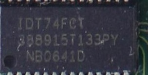
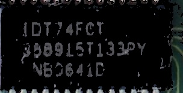

# detect (and replace) a specific **HSV_based or HSL_based** background color Considering the maximum difference in HSV instead of RGB values
first of all i apologize for my english. I am an electrical engineering PhD student in university of Tehran, Iran.  
this code is an extraction of color similarity based on HSV parameters which is closer to the similarity of color in the human concept. 
here we accept a few difference between ideal color and pixel color. 
Considering that the photos were taken in the real environment, as a result the background will not be completely black or white and etc.  
As a result, using offline or online color-pickers, we can earn the actual color of the background.  
In this coding, the internet address https://imageresizer.com/color-picker is used to extract the colors, but as mentioned, there are different methods to extract the color of the image.  
It should also be noted that due to the fact that color extraction is more available in RGB format, the user does not need to extract HSV values, but simply extracting color values ​​in RGB format is sufficient. Color conversion from RGB to HSV is done automatically in the code. 
if there is a problem cantact me using my email address: sh.dalirian@ut.ac.ir 
my linkedin profile address is : linkedin.com/in/sh-d-30174b77  
## run: main.py
the main function in this application is: 
**background_color(img,background_ratio:int=50,dist:int=50,sensivity:str="uniform",black_color=np.uint8([[45,47,60]]),white_color=np.uint8([[215,215,225]]))**  
The background_color function is called to detect the background. here we suppose there just two type of background color but you easily can add more. 
According to above, this function has five inputs. 
1. img: The first input is an image whose background is to be detected. 
2. background_ratio: The second input is the minimum ratio of the presence of that color to the total number of pixels in the image and has a default value of 50, which means that if 50% of the image is similar enough to black (white), the background is known as black (white). 
3. The third input of this function is dist. This variable specifies the maximum color difference of the pixel with the HSV color of the black background. The default value of this variable is 50, which means that if the square of the squared difference between the pixels with the selected color is less than 50, it will be counted in counting the number of pixels similar to that particular color. 
4. sensivity: sensivity has three modes: {"uniform" for uniform distribution, "center" for focusing on the center, "around" focusing on the edge of the image} This sensitivity is defined by the sensitivity input variable, which by default calculates the color similarity uniformly without considering the (x,y) location of pixcel. 
5. black_color, white_color: In the next entries, the HSV values ​​are black and white colors so that we can check the number of similar pixels. 
It should be noted that this category can be much wider as explained earlier. 
## application:
detect (and replace) specific color in image based on HSV parameters instead of RGB with an specific HSV-distance range acceptable.  

## adjustable parameters:
text_pixel_ratio to total pixels is defined as input parameter and has defualt value equal to 20%  
symbol_pixel_ratio to total pixels is defined as input parameter and has defualt value equal to 70%  
this code is generaly written for all black or white background which can de adjusted using "is_background_white" input parameter and has defualt value equal to True  
## example:
here is some examples: 
### example 1:
here we wnat to detect black background of image and replace it with ideal black color (0,0,0). 
original image is:   
improved black background image is:   
